# Simple Light Probe Placer

- [About](#about)
- [Light Probe Volume](#light-probe-volume)
 - [Create](#crt-lpv)
 - [Inspector](#ins-lpv)
 - [Density](#density)
 - [Fixed](#fixed)
 - [Float](#float)
- [Light Probe Group Control](#light-probe-group-control)
 - [Create](#crt-lpgc)
 - [Inspector](#ins-lpgc)
 - [Point Lights](#point-lights)
- [Example usage](#example-usage)
- [Also](#also)

# About

| [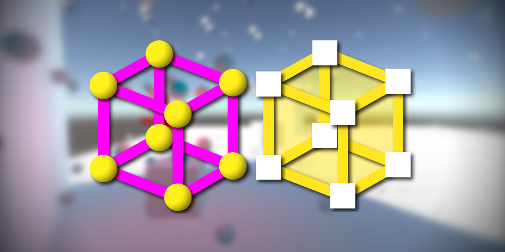](https://github.com/AlexanderVorobyov/simple-light-probe-placer/raw/master/Documentation/img/background.jpg) |
| :---: |
| **[Simple Light Probe Placer](https://www.assetstore.unity3d.com/en/#!/content/58290)** |

**Simple Light Probe Placer** it is simple tool for [Unity3d](https://unity3d.com/)
and it help you easily place **Light Probes** in your scene.
It's provides two new components: **Light Probe Volume** and **Light Probe Group Control**,
on which you can read below.

**[Link to AssetStore](https://www.assetstore.unity3d.com/en/#!/content/58290)**

| Version | Description |
| --- | --- |
| **1.0.11** |  Small fix on MergeClosestPositions, for preventing error. |
| **1.0.10** | Some fixes. |
| **1.0.9.1** |  |

# Light Probe Volume
**Light Probe Volume** it’s important part of **Simple Light Probe Placer**
and can help you easily place your probes all over the scene.
Provides simple volume (or bounding box) with density settings,
which you can use for determine where probes should be.

<a name="crt-lpv" />
## Create
You can create new instance, just using create menu on top of
**Hierarchy** tab or add new **Light Probe Volume** component to your
**GameObject** using **Add Component** menu.

| [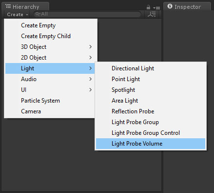](https://github.com/AlexanderVorobyov/simple-light-probe-placer/raw/master/Documentation/img/create_2.jpg) |
| :---: |
| **Path:** Create > Light > Light Probe Volume |

| [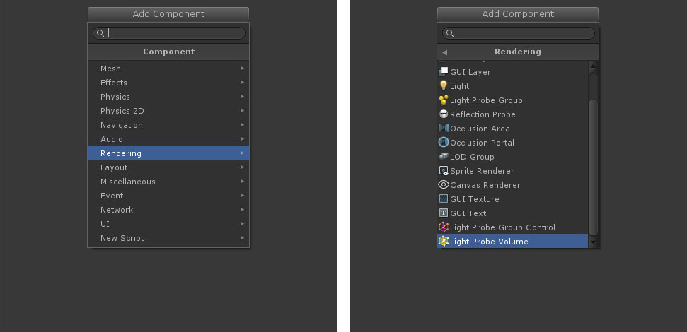](https://github.com/AlexanderVorobyov/simple-light-probe-placer/raw/master/Documentation/img/inspector_menu_01.jpg) |
| :---: |
| **Path:** Add Component > Rendering > Light Probe Volume |

After when you add in scene new **Light Probe Volume**, you should see this (without 3d gimzo).
Yellow squares it is handles for changing size of volume and small white squares
represents places in scene, where it will create **Light Probe**.

> **Note:** If you want hide 3d gizmos see [here](#also).

| [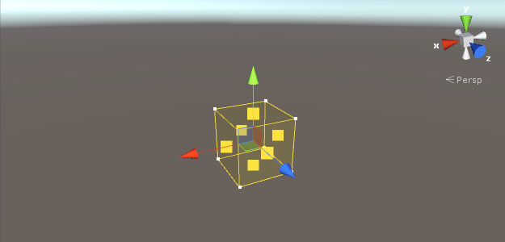](https://github.com/AlexanderVorobyov/simple-light-probe-placer/raw/master/Documentation/img/scene_lpv.jpg) |
| :---: |
| Light Probe Volume in scene. |

<a name="ins-lpv" />
## Inspector
| [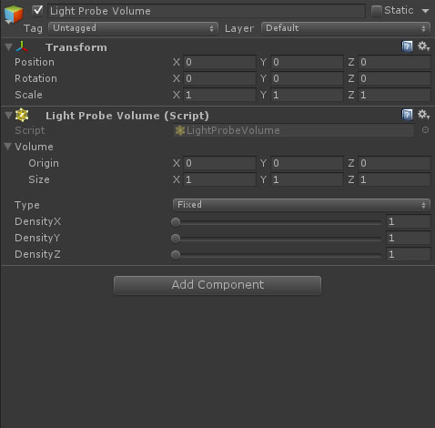](https://github.com/AlexanderVorobyov/simple-light-probe-placer/raw/master/Documentation/img/inspector_lpv.jpg) |
| :---: |
| It’s how it looks in inspector. |

| Name | Description |
| --- | --- |
| **Volume** | Parameters for volume (or bounding box). |
| **Origin** | Position of center of volume. |
| **Size** | Size of volume. |
| **Type** | Type of density, which can be: Fixed or Float. Possible values: Fixed **1-100**, Float **0.1-50**. |
| **DensityX** | Control density by x axis. |
| **DensityY** | Control density by y axis. |
| **DensityZ** | Control density by z axis. |

> **Note:** Volume parameters almost the same as in another components (like **Collider**).
> You can manually change origin position and size.

## Density
**Light Probe Volume** has two types of density: **Fixed** and **Float**.

| [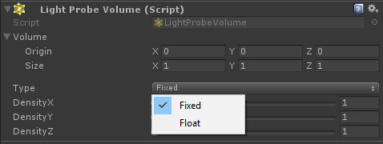](https://github.com/AlexanderVorobyov/simple-light-probe-placer/raw/master/Documentation/img/inspector_lpv_type.jpg) |
| :---: |
| Type of density. |

## Fixed
Fixed density depend on how much it should divide space inside volume by specified axis
for placing probes. And density always will be fixed, regardless of volume size.

| [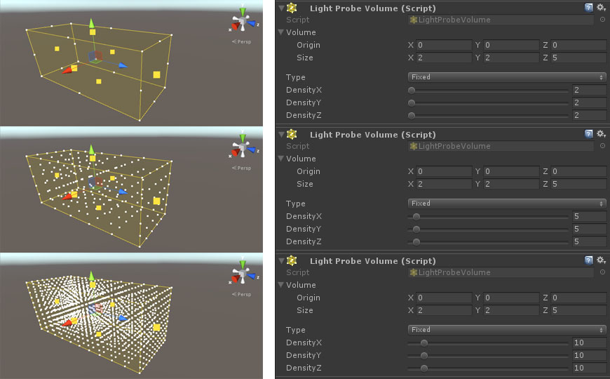](https://github.com/AlexanderVorobyov/simple-light-probe-placer/raw/master/Documentation/img/fixed_density.jpg) |
| :---: |
| Example of different fixed density settings. |

| [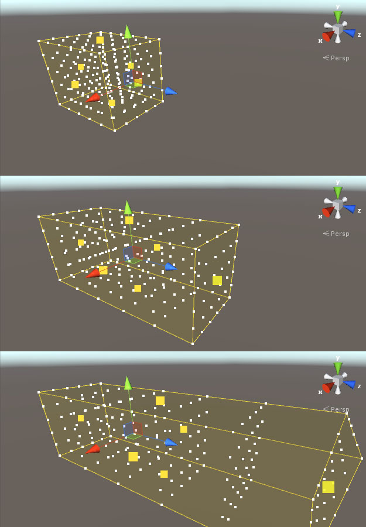](https://github.com/AlexanderVorobyov/simple-light-probe-placer/raw/master/Documentation/img/fixed_size_scene_0.jpg) |
| :---: |
| Example of how is changing density with fixed type, depend on volume size. |

## Float
Float density depend on distance between each probe in specified axis.
It will fills space inside volume, so density always will be float and will depend on volume size.

| [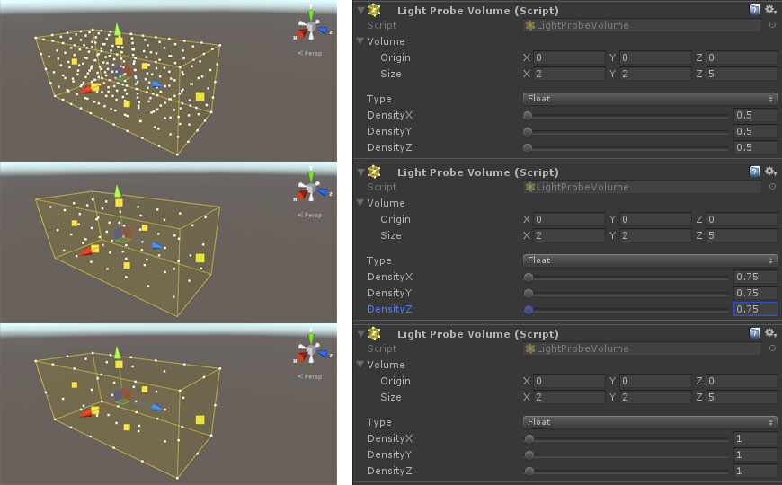](https://github.com/AlexanderVorobyov/simple-light-probe-placer/raw/master/Documentation/img/float_density.jpg) |
| :---: |
| Example of different float density settings. |

| [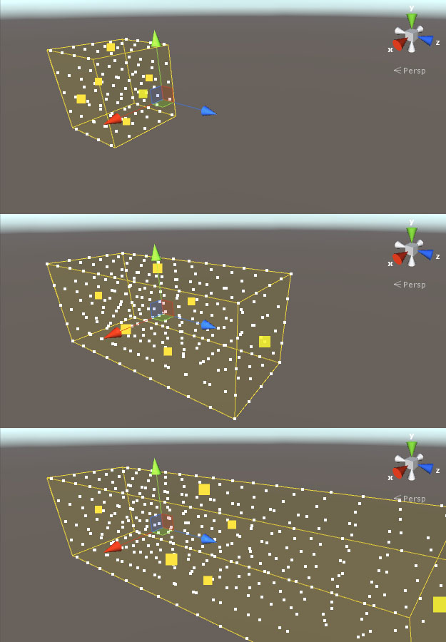](https://github.com/AlexanderVorobyov/simple-light-probe-placer/raw/master/Documentation/img/float_size_scene_0.jpg) |
| :---: |
| Example of how is changing density with float type, depend on volume size. |

## Light Probe Group Control
**Light Probe Group Control** is second part of **Simple Light Probe Placer** and controls **Light Probe Group**,
attached to the same **GameObject**. It will finds all **Light Probe Volume** and using them settings for creating
**Light Probe** positions, for future scene baking.

> **Note:** **Light Probe Group Control** require **Light Probe Group** component.

<a name="crt-lpgc" />
## Create
You can create new instance, just using create menu on top of
**Hierarchy** tab or add new **Light Probe Group Control** component to your
**GameObject** using **Add Component** menu.

> **Note:** After add new **Light Probe Group Control** component, it will automatically add **Light Probe Group** to the same **GameObject**.

| [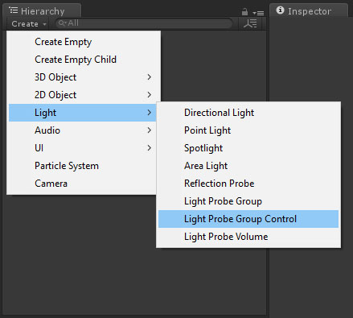](https://github.com/AlexanderVorobyov/simple-light-probe-placer/raw/master/Documentation/img/create_1.jpg) |
| :---: |
| **Path:** Create > Light > Light Probe Group Control |

| [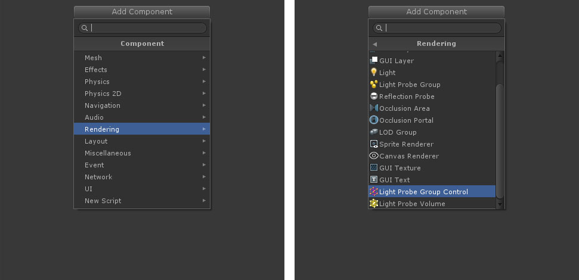](https://github.com/AlexanderVorobyov/simple-light-probe-placer/raw/master/Documentation/img/inspector_menu_02.jpg) |
| :---: |
| **Path:** Add Component > Rendering > Light Probe Group Control |

In scene it will looks like this (without 3d gimzo).

> Note: If you want hide 3d gizmos see [here](#also).

| [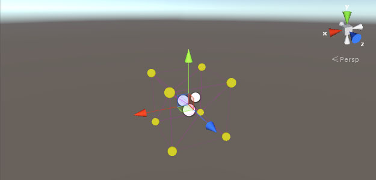](https://github.com/AlexanderVorobyov/simple-light-probe-placer/raw/master/Documentation/img/scene_lpgc.jpg) |
| :---: |
| Light Group Control in scene. |

<a name="ins-lpgc" />
## Inspector
| [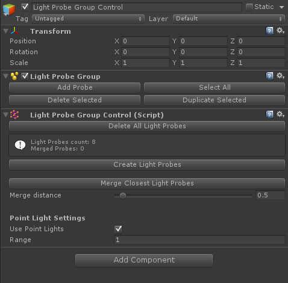](https://github.com/AlexanderVorobyov/simple-light-probe-placer/raw/master/Documentation/img/inspector_lpgc.jpg) |
| :---: |
| Light Group Control in inspector. |

| Name | Description |
| --- | --- |
| **Delete All Light Probes** | It will delete all **Light Points** positions in **Light Probe Group** attached to this **GameObject**. |
| **Information** | Provides some information, about how many light probe position you have and how many positions was merged. |
| **Create Light Probes** | Create probe positions using all **Light Probe Volume** found in scene and merge closest positions, depend on merge distance option. |
| **Merge Closest Light Probes** | Merge closest positions depending on merge distance. |
| **Merge distance** | The minimal distance between probe positions for merging. |
| **Point Light Settings** | Provides settings for **Point Lights**. |
| **Use Point Lights** | Determines whether it will use **Light Points** for creating probes positions. |
| **Range** | Distance from **Point Light** for create probe positions around. |

## Point Lights
Using this options, you can create **Light Probes** around **Point Lights**
and control distance to it, using **Range** option (see above in table).

| [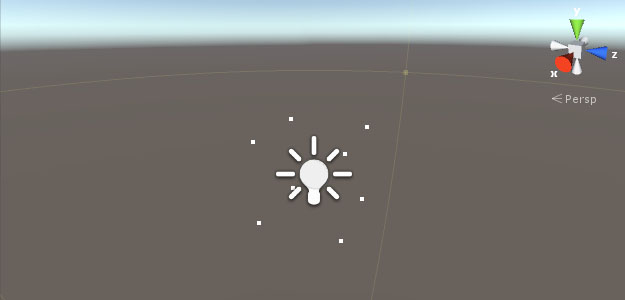](https://github.com/AlexanderVorobyov/simple-light-probe-placer/raw/master/Documentation/img/scene_light.jpg) |
| :---: |
| How it’s look like in scene. |

| [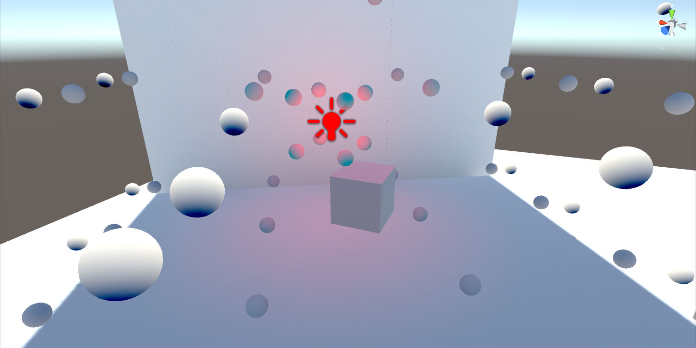](https://github.com/AlexanderVorobyov/simple-light-probe-placer/raw/master/Documentation/img/scene_end_1.jpg) |
| :---: |
| Worked example. |

# Example usage
It is example how it's worked. Scroll down to see steps.

| [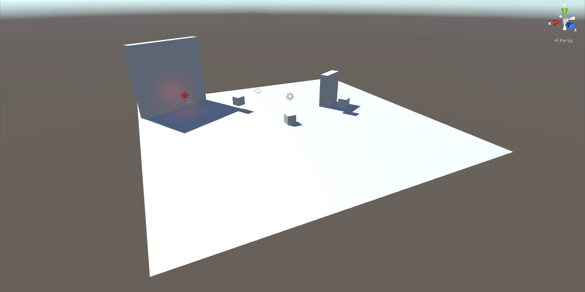](https://github.com/AlexanderVorobyov/simple-light-probe-placer/raw/master/Documentation/img/scene_create_1.jpg) |
| :---: |
| Step 1: We have scene without any baked data. |

| [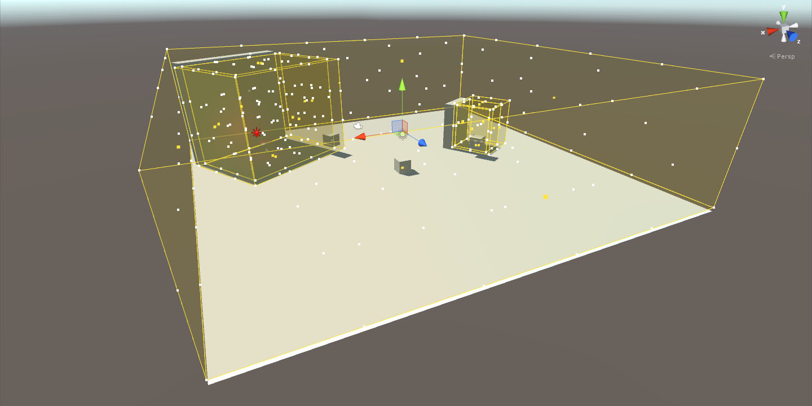](https://github.com/AlexanderVorobyov/simple-light-probe-placer/raw/master/Documentation/img/scene_create_2.jpg) |
| :---: |
| Step 2: Now we should place everywhere where it's need **Light Probe Volume** and set up size and density for each. |

> Note: Don't forget add **Light Probe Group Control**.

| [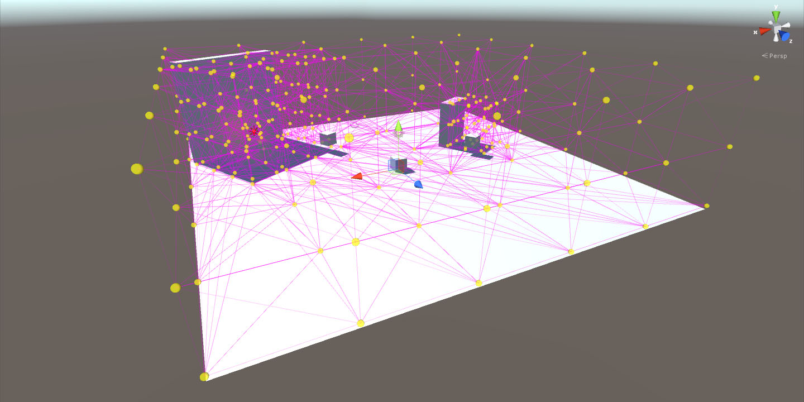](https://github.com/AlexanderVorobyov/simple-light-probe-placer/raw/master/Documentation/img/scene_create_3.jpg) |
| :---: |
| Step 3: After you finish setup all **Light Probe Volume**, in **Light Probe Group Control** press a **Create Light Probes** button. |

| [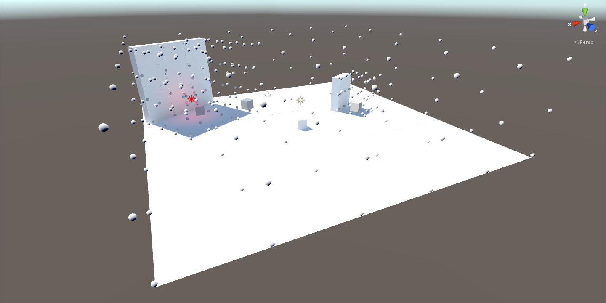](https://github.com/AlexanderVorobyov/simple-light-probe-placer/raw/master/Documentation/img/scene_create_4.jpg) |
| :---: |
| Step 4: And finally bake you scene data. |

# Also
If you have some problems with annoying 3d gizmos of all **Light Probe Volume**, it's help you.
It is very simple, on the top-right corner of **Scene** tab, will button with name **Gizmos**, here you
can find list of all gizmos for showing in **Scene** window. After open it, you should see something
similar with what shows in first column on image below and you can just press on icon of what you want to hide or show in **Scene**.
That's all and Good Luck!

| [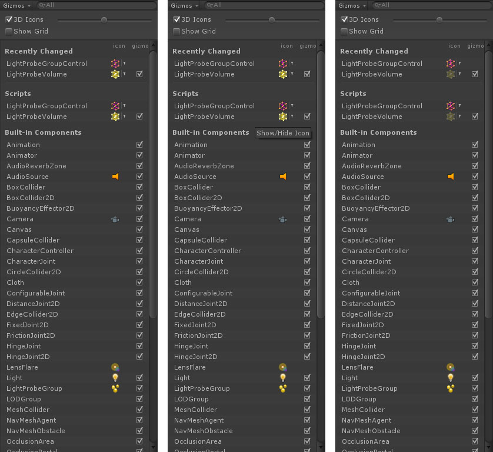](https://github.com/AlexanderVorobyov/simple-light-probe-placer/raw/master/Documentation/img/gimzos_0.jpg) |
| :---: |
| How turn off scene gizmos. From right to left. |

---
[Move up](#simple-light-probe-placer)

---
